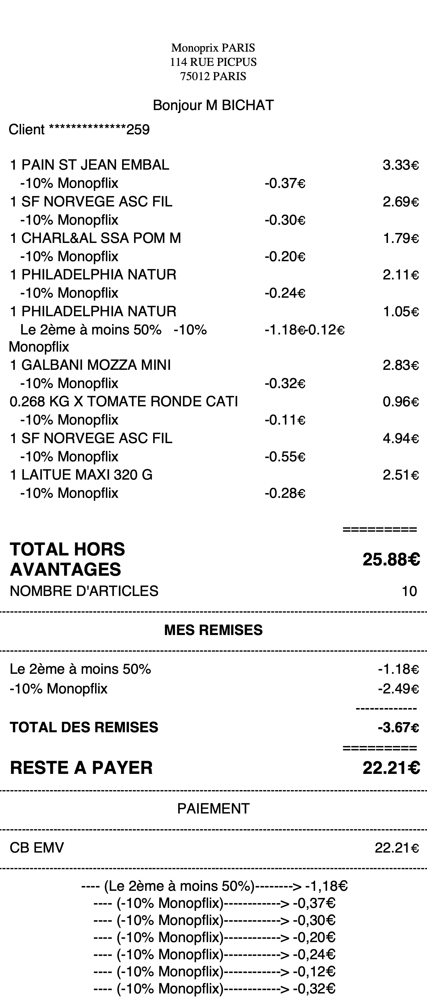

<!-- README.md is generated from README.Rmd. Please edit that file -->

```{r, include = FALSE}
knitr::opts_chunk$set(
  collapse = TRUE,
  comment = "#>",
  fig.path = "man/figures/README-",
  out.width = "100%"
)
```

# monopreceipt

```{r, echo = FALSE}
version <- as.vector(read.dcf('DESCRIPTION')[, 'Version'])
version <- gsub('-', '.', version)
```

<!-- badges: start -->

[](https://github.com/abichat/monopreceipt/actions/workflows/R-CMD-check.yaml)
<!-- badges: end -->

`monopreceipt` allow users to read information from Monoprix PDF receipts.

## Installation

You can install the development version of monopreceipt from [GitHub](https://github.com/) with:

``` r
# install.packages("remotes")
remotes::install_github("abichat/monopreceipt")
```

## How to read a receipt

A Monoprix receipt looks like this:

<p align="center">
   
</p>

To read it, you need to give the path to `read_receipt()`.

```{r example}
library(monopreceipt)
path_to_pdf <- system.file("extdata/receipts/receipt-22_09_27.pdf", 
                           package = "monopreceipt")
receipt <- read_receipt(path_to_pdf)
```

The result will be a tibble with formatted information.

```{r}
receipt
receipt$purchases_detail[[1]]
receipt$discounts_detail[[1]]
```

