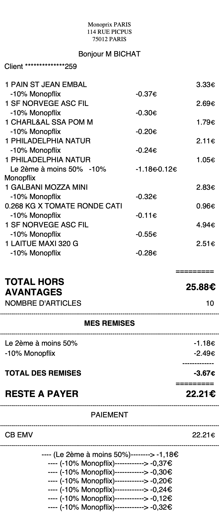
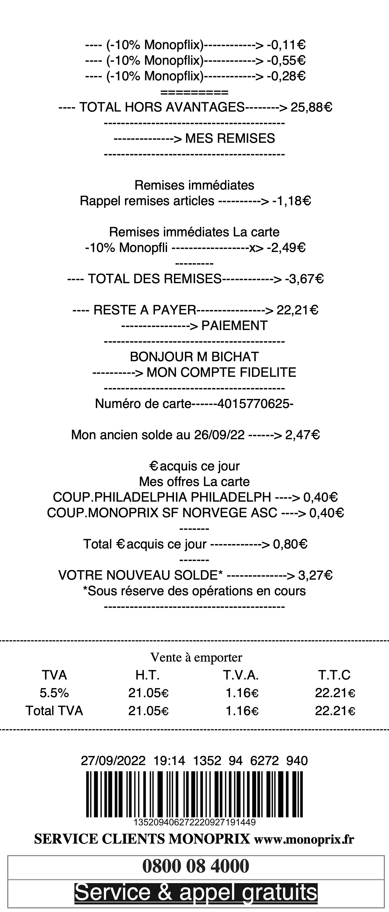

<!-- README.md is generated from README.Rmd. Please edit that file -->

# monopreceipt

<!-- badges: start -->
<!-- badges: end -->

`monopreceipt` allow users to read information from Monoprix PDF
receipts.

## Installation

You can install the development version of monopreceipt from
[GitHub](https://github.com/) with:

``` r
# install.packages("remotes")
remotes::install_github("abichat/monopreceipt")
```

## How to read a receipt

A Monoprix receipt looks like this:

<p align="center">


</p>

To read it, you need to give the path to `read_receipt()`.

``` r
library(monopreceipt)
path_to_pdf <- system.file("extdata/receipts/receipt-22_09_27.pdf", 
                           package = "monopreceipt")
receipt <- read_receipt(path_to_pdf)
```

The result will be a tibble with formatted information.

``` r
receipt
#> # A tibble: 1 × 10
#>   date       time  address   city  client total total…¹ to_pay purcha…² discou…³
#>   <chr>      <chr> <chr>     <chr> <chr>  <dbl>   <dbl>  <dbl> <list>   <list>  
#> 1 27/09/2022 19:14 114 Rue … 7501… M BIC…  25.9   -3.67   22.2 <tibble> <tibble>
#> # … with abbreviated variable names ¹​total_discount, ²​purchases_detail,
#> #   ³​discounts_detail
receipt$purchases_detail[[1]]
#> # A tibble: 9 × 5
#>   product                quantity price discount discounts_names                
#>   <chr>                     <dbl> <dbl>    <dbl> <chr>                          
#> 1 PAIN ST JEAN EMBAL        1      3.7     -0.37 -10% Monopflix                 
#> 2 SF NORVEGE ASC FIL        1      2.99    -0.3  -10% Monopflix                 
#> 3 CHARL&AL SSA POM M        1      1.99    -0.2  -10% Monopflix                 
#> 4 PHILADELPHIA NATUR        1      2.35    -0.24 -10% Monopflix                 
#> 5 PHILADELPHIA NATUR        1      2.35    -1.3  Le 2ème à moins 50% -10% Monop…
#> 6 GALBANI MOZZA MINI        1      3.15    -0.32 -10% Monopflix                 
#> 7 KG X TOMATE RONDE CATI    0.268  1.07    -0.11 -10% Monopflix                 
#> 8 SF NORVEGE ASC FIL        1      5.49    -0.55 -10% Monopflix                 
#> 9 LAITUE MAXI 320 G         1      2.79    -0.28 -10% Monopflix
receipt$discounts_detail[[1]]
#> # A tibble: 2 × 2
#>   discount_name       agg_discount
#>   <chr>                      <dbl>
#> 1 Le 2ème à moins 50%        -1.18
#> 2 -10% Monopflix             -2.49
```
